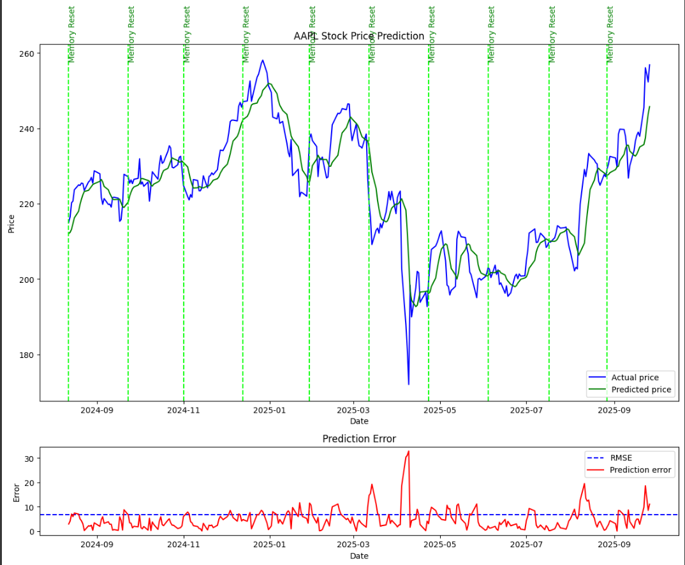
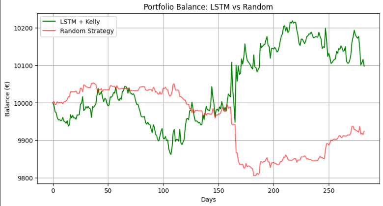

# deep-learning-stock-forecast [](
https://colab.research.google.com/github/Neelgrevy92/deep-learning-stock-forecast/blob/main/notebook.ipynb)
LSTM-based stock price prediction with PyTorch and a simple trading backtest strategy.


Deep learning project applied to finance:  
Forecasting **AAPL (Apple)** stock prices using an **LSTM model**, with a backtest 
of a simple signal-based trading strategy.

## Features
- Automatic data download via [yfinance](https://pypi.org/project/yfinance/).
- Price preprocessing with `MinMaxScaler`.
- **LSTM neural network (PyTorch)** for stock price prediction.
- Performance visualization (train/test, errors).
- Simplified backtest using the **Kelly Criterion** + stop-loss/take-profit.


## 📊 Example Results
  



⚙️ Installation
```bash
git clone https://github.com/Neelgrevy92/LSTM-stock-prediction.git
cd LSTM-stock-prediction
pip install -r requirements.txt
